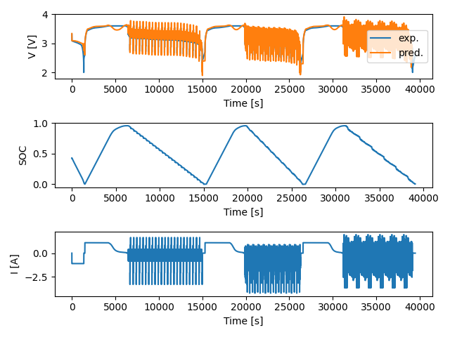

# Equivalent Circuit Model for Lithium-Ion Batteries
### Copywrite©️ 2023 by Moin Ahmed. All Rights Reserved.

This repository contains the code for simulating the terminal voltage of the lithium-ion battery (LIB) using Thevenin equivalent-circuit model.

